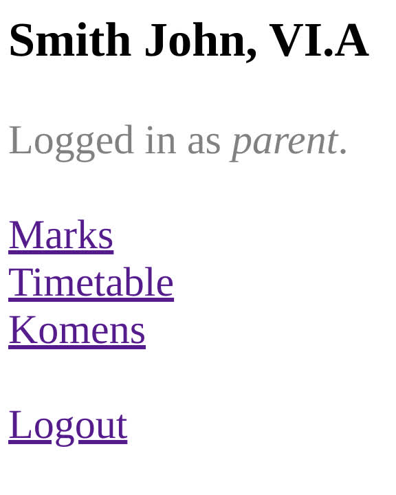
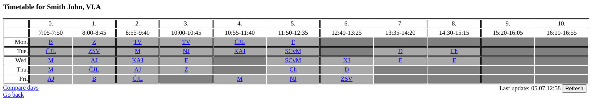
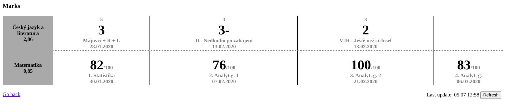
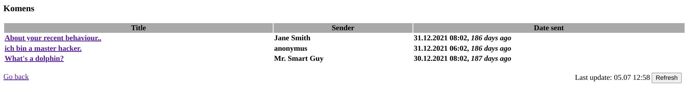

# BakaWeb

An alternative web client for the [Bakaláři](https://bakalari.cz/) school system.

## Screenshots

## How to run

1. [Clone the repository](https://github.com/TriLinder/BakaWeb/archive/refs/heads/main.zip)

2.  Install `requirements.txt`

3. Run `main.py`

4. Connect to [http://localhost:5000/](http://localhost:5000/) in your web browser

5. Done!
   
----
   
To allow connecting to unofficial servers, set `allowCustomURLs` at the top of the file to `True`. This, however, could be a security risk, and is not recommended.

---

Huge thanks to the people over at [https://github.com/bakalari-api/bakalari-api-v3](https://github.com/bakalari-api/bakalari-api-v3), for documenting the Bakaláři API.